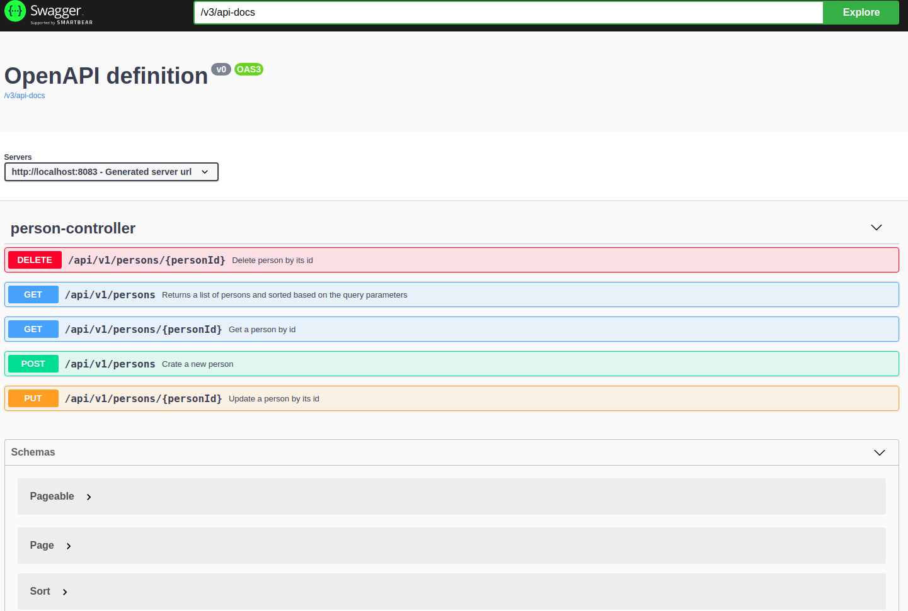

# Person Service

This is a spring boot application that uses exposes restfull apis for the person entity.
It uses Spring Data to fetch/retrieve/update/delete data in a relational database.
It is using EHCache as 2nd level cache
It uses ELK for extensive logging.
Using open api for the documentation of restfull apis.
All the tools like ELK and mysql database are configured using docker compose

##Setup
To use application in the production environment execute prod bash file. It will create setup base environment and start spring boot application with h2 as relational database
If you want to use extensive logging then use dc file it will setup docker environment which will use elk stack for centralized logging. It uses mysql as base datbase.
For development, you can use dev file.

To generate javadocs execute docs file. It wil generate javadocs and put it in target/site folder.

To view restful apis documentation navigate to http://localhost:{port}/swagger-ui-custom.html

